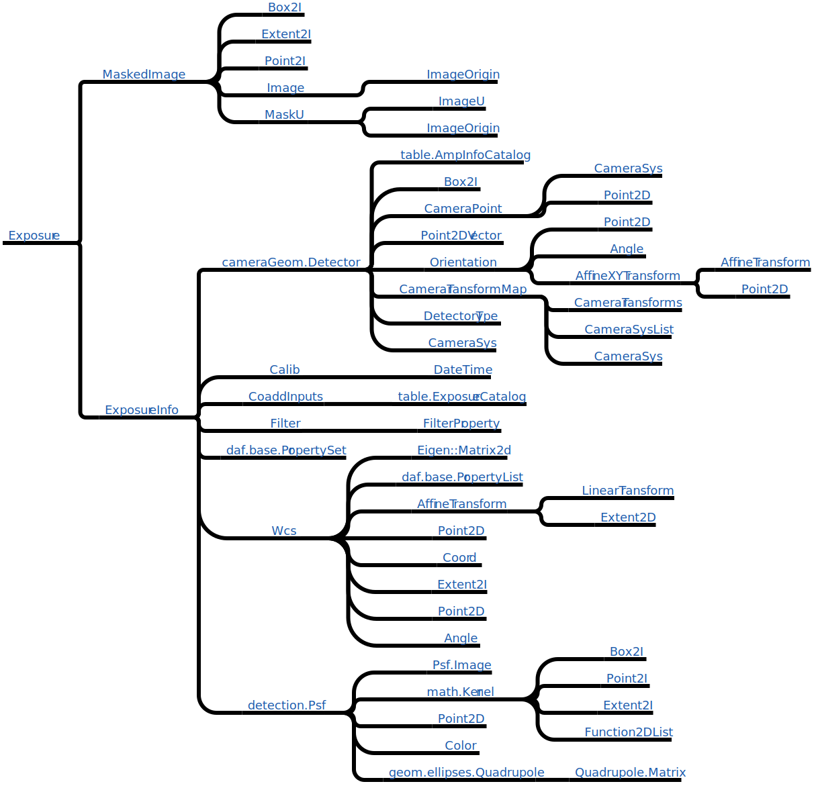

 ## Python/C++ Interface investigations

Following a discussion with the Astropy team it was decided that we would consider whether the Python/C++ boundary in the LSST software stack is currently in the correct location. At present, the default situation is for much of the core LSST code to be written in C++ and then provide a SWIG interface for use from Python. This is done so that other C++ code can use the infrastructure libraries interchangeably without having to know that Python is involved at all. This approach leads to two obvious shortcomings when the code is given to someone expecting that the primary language is Python:

1. The default SWIGged Python interfaces do not look "pythonic" in the sense that:

    * Attributes are implemented by explicit getter and setter methods rather than looking like attributes.
    * The constructors tend to be highly complex but also opaque, using `*args` rather than named arguments.
    * Python objects stringify in ways that make them impenetrable to someone who does not have a C++ background:
    ```python
    >>> mi = afwImage.MaskedImageD(5, 4)
    >>> print(repr(mi))
    <lsst.afw.image.imageLib.MaskedImageD; proxy of <Swig Object of type 'boost::shared_ptr< lsst::afw::image::MaskedImage< double,lsst::afw::image::MaskPixel,lsst::afw::image::VariancePixel > > *' at 0x10ab0b480> >
    ```

    * The Python documentation is almost non-existent and very unfriendly to a Python programmer, resulting in the APIs being presented with very little support text and using C++ language concepts. See for example this Python documentation for the `lsst.afw.image.ExposureD.getInfo()` method:
    ```
    getInfo(self, *args)
       getInfo(ExposureD self) -> boost::shared_ptr< lsst::afw::image::ExposureInfo >
       getInfo(ExposureD self) -> boost::shared_ptr< lsst::afw::image::ExposureInfo const >
    ```

2. Classes that are commonly used by Python programmers in astronomy, such as Astropy coordinates and Pandas for table manipulation, are almost impossible to use in relation to LSST software as this functionality is implemented independently in C++.

The current default is for library code to be written in C++ and then SWIGged in order to ensure that the code can be called from C++ and Python and, nominally, to ensure maximum performance. The work described in this document addresses whether we should adopt a "Python First" philosophy in the LSST data management software.

## Plan

The investigation consisted of 3 phases:

1. Determine the feasibility of wrapping the SWIG interfaces in Python code to present a more Pythonic view of the world to the public interfaces.
2. Take a simple C++ object and reimplement it in Python with the aim of pushing the C++ boundary lower into the stack.
3. Compare performance of cython/numba with native C++.

### Wrapping the SWIG

The easiest way to hide the C++ is to provide Python "shim" classes around all the SWIG-generated Python classes. For example converting:
```python
e = afwGeom.Extent2I(3, 5)
x = e.getX()
y = e.getY()

exp = afwImage.ExposureD(e)
bbox = exp.getBbox()
area = bbox.getArea()

mi = exp.getMaskedImage()
var = mi.getVariance()
```

to

```python
e = geom.Extent(3, 5)
x = e.x
y = e.y

exp = image.Exposure(e, dtype=np.float64)
bbox = exp.bbox
area = bbox.area

mi = exp.masked_image
var = mi.variance
var[0:2,3:5] = np.array([[1,2],[3,4]])
```

Proof of concept wrappers have been written for `Exposure`, `Extent`, `Point`, `Box`, `MaskedImage`, and `CoordinateExpr`.

Some notes:

* All wrappers use the same attribute name to store the internal SWIGged object. This allows the C++ object to be extracted from the argument list when it is known that the arguments are to be passed to a C++ object.
* As an experiment two different schemes are used for dealing with data types. In `Exposure` the data type is passed in to the constructor using the standard numpy convention. The returned object is a generic `Exposure` containing a SWIGged object of the relevant type (e.g. `ExposureD`). In the second approach the `Extent` and `Point` constructors determine their data type and dimensionality from the supplied arguments but return a typed object of `Extent2I`, `Point3D` etc.
* The code uses PEP8 coding conventions and therefore does not use camel case for method names: `compute_squared_norm` versus `computeSquaredNorm`.


For code examples and an initial implementation see <https://github.com/lsst-dm/python-experiments>.

One problem with the simplistic wrapping approach is that it does not solve the problem of "surprisingly complicated" error messages bubbling up from the C++ layer.

### Reimplementing a C++ class in Python

The next stage is to rewrite an entire class in Python and make it unavailable from the C++ side. The mooted example was `Exposure` which is a convenient grouping of classes related to a particular exposure and includes a `MaskedImage` and `ExposureInfo` object. Reimplementing `Exposure` and `ExposureInfo` in pure Python is relatively straightforward. The complication is in transferring the relevant information to a C++ routine. The measurement infrastructure makes most use of `Exposure` but there is also warping. Warping requires access to the MaskedImage/Image and the WCS.

> If WCS is needed inside a C++ routine, then WCS can not be implemented purely in python using, say, the Astropy gWCS implementation. The [AST library](http://www.starlink.ac.uk/ast) could be an alternative, a C object available in python, unless we wish to reimplement Astropy gWCS in C/C++, possibly including a C++ implementation of [ASDF](http://asdf-standard.readthedocs.org/en/latest/).

The figure below gives an overview of the classes required for `Exposure` to function (this is not a class hierarchy, more of a "used by" diagram). These are all implemented currently in C++ in the AFW package. It is clear that it is entirely possibly for `Exposure` to be Python containing a C++ `MaskedImage` and C++ members of a Python `ExposureInfo`. In a worst case, a single argument would be replaced by eight.



The worry is that we replace a Python/C++ interface that passes in a single object with a "Fortran" style call that passes in tens of explicit arguments using simple data types (strings, numeric scalars and numpy arrays). Is there a middle ground where a simple struct could be passed in rather than a full C++ object? Ideally we should audit the current interfaces to see how much information is required for each use of `Exposure` in C++.


### Cython/Numba

Numba: <http://numba.pydata.org>

Cython: <http://cython.org>

See for example:

* <https://jakevdp.github.io/blog/2013/06/15/numba-vs-cython-take-2/> from 2013.
* <http://continuum.io/blog/numba_performance> also from 2013
* <http://eng.climate.com/2015/04/09/numba-vs-cython-how-to-choose/>

The main issue for LSST is whether the critical performance sections of the code base can be self-contained rather than being tightly integrated into the stack as a whole. One example is convolution of an Image by a PSF. Is there any expectation that a PSF could be defined in pure python code? How do we handle PSFs that vary across the image and so must therefore be calculated dynamically? Even if the PSF is a simple numpy array and the image is a numpy array, how much faster is the C++ implementation than a cython/numba implementation?

#### Comparison

The AFW `convolve.py` test compares a python/numpy convolver with the AFW C++ convolver. The C++ implementation is approximately 3000 times faster than the python version. Given the python code the next step was to convert this to support numba and cython.

The Cython implementation uses Python memory views rather than numpy directly. It is possible to convert the memoryview to a numpy object and call numpy methods but that involves a performance hit. All variables have to be typed for best performance and cython optimizes `for i in range(intvar)` syntax for looping. `numpy.<operator>.reduce(<array>.flat)` calls had to be replaced with explicit `for` loops. Once this was done the cython implementation was 150 times faster than Python/numpy, but 20 times slower than the C++. Cython can call native C/C++ code pretty easily if you need ultimate performance. One nice feature of cython is the annotation tool that will parse the cython file and create an html page to indicate where the problem points are located.


__Note that numba in Anaconda 2.1.0 (version 0.14) is very very buggy. It was unable to optimize the Python convolver, complaining about the loops. Updating to v0.18 fixed all the weirdness and now numba performs slightly better than cython in most cases.__

numba sounds great in that you write your python code, add an `@jit` decorator and revel in the joy of the speed increase. In reality this doesn't happen if you are actually doing something python-y in your python code. numba has similar problems to Cython in supporting numpy. Some APIs are supported and some are not (of note in this example is no support for `reduce()`). Additionally numba has a slow "object" mode and a fast native "nopython" mode for Jit compilation and you only get a real performance gain if you can write your code to use the supported subset. You can not allocate numpy arrays and expect to use the fast mode and for maximum performance the loops should be moved into their own routines (passing the output arrays in as arguments). Saying all this, the amazing thing is that if you follow the rules it really does work. Factoring the convolution core loops in to their own routine and not calling any numpy APIs, resulted in a speed up that sometimes got within a factor of almost 2 of the AFW C++ implementation. This is astonishing when it was achieved without any explicit data typing from the python programmer.

Numba is approximately 2-5 times slower than C++ AFW; whilst Cython is approximately 3-5 times slower than numba in this example. It's entirely possible that some extra gains can be made by more careful reading of the documentation.

Here is the numba code for the tight loop:
```python
@jit(nopython=True)
def runRefConvolveJitLoop(ignore_zero_pix, retRowRef, retColRef, numRows, numCols, kWidth, kHeight,
                          kImArr, image, variance, mask, retImage, retVariance, retMask):
    retRow = retRowRef
    for inRowBeg in range(numRows):
        inRowEnd = inRowBeg + kHeight
        retCol = retColRef
        for inColBeg in range(numCols):
            inColEnd = inColBeg + kWidth
            subImage = image[inColBeg:inColEnd, inRowBeg:inRowEnd]
            subVariance = variance[inColBeg:inColEnd, inRowBeg:inRowEnd]
            subMask = mask[inColBeg:inColEnd, inRowBeg:inRowEnd]
            sum = 0.0
            varsum = 0.0
            outmask = 0
            for i in range(kWidth):
                for j in range(kHeight):
                    sum += subImage[i, j] * kImArr[i, j]
                    varsum += subVariance[i, j] * kImArr[i, j] * kImArr[i, j]
                    if ignore_zero_pix:
                        if kImArr[i, j] != 0:
                            outmask |= subMask[i, j]
                    else:
                        outmask |= subMask[i,j]
            retImage[retCol, retRow] = sum
            retVariance[retCol, retRow] = varsum
            retMask[retCol, retRow] = outmask
            retCol += 1
        retRow += 1
    return
```

The cython implementation looks similar except all the variables must be declared to have a specific type explicitly. This will make it hard to deal with handling all the different data types without having a forwarding routine that checks the numpy types and forwards to the correct cython routine.

###Summary

The fundamental question is whether the LSST DM stack can be 95% python, with C/C++ limited to key performance areas? Does there have to be any WCS handling in C/C++ or can it be kept entirely in Python? Can the stack become a Python project, built with setuptools, documented in Sphinx and distributed on pypi?
